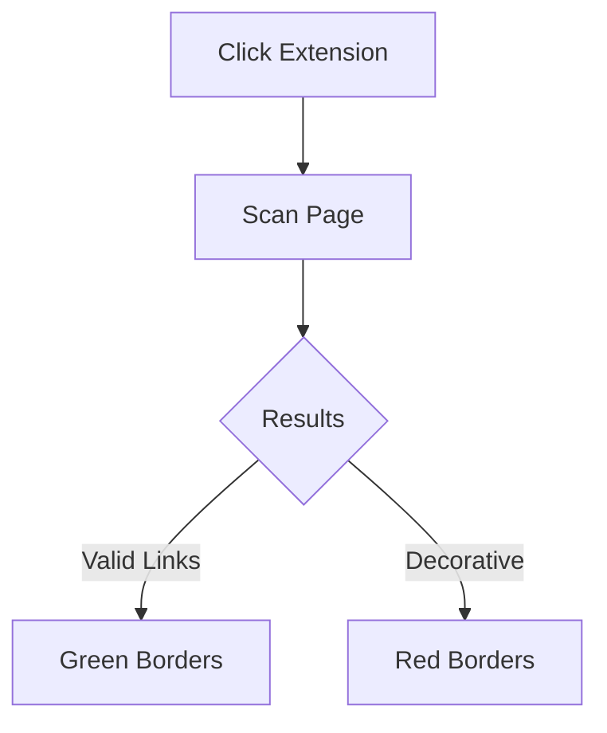

# 🔍 Underlink Scanner Chrome Extension

## ✨ Features
- One-click page scanning
- Visual validation indicators:
  - ✅ Active links (green border)
  - ❌ Non-clickable underlines (red border)
- Lightweight (no page slowdown)
- No external dependencies

## 🚀 Quick Start
1. Clone the repo:
   ```bash
   git clone https://github.com/yourusername/underlink-scanner.git
   ```
2. Load in Chrome:
   - Navigate to `chrome://extensions`
   - Enable Developer Mode (top-right)
   - Click "Load unpacked" and select the folder

## 🖥️ Usage


## 📸 Screenshots
| Interface | Results |
|-----------|---------|
|| |

## 📂 Files
```
underlink-scanner/
├── manifest.json
├── popup.html
├── popup.js
├── contentScript.js
└── README.md
```

## 📜 License
MIT © 2023 [Amine-ellafi] - See [LICENSE](LICENSE)

---
📬 **Contact**: amineellafi@isikef.u-jendouba.tn  
🔗 **GitHub**: https://github.com/Amine-ellafi


